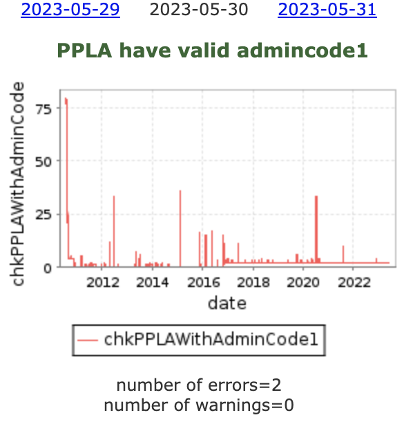

Material for Data Quality in a Data Engineering perspective
===========================================================

# Table of Content (ToC)
* [Overview](#overview)
* [References](#references)
  * [Use cases](#use-cases)
    * [Geonames](#geonames)
    * [OpenTravelData (OPTD)](#opentraveldata-optd)
  * [Articles](#articles)
    * [4 Key Benefits of Shift Left](#4-key-benefits-of-shift-left)
    * [Seven Dimensions of Data Quality](#seven-dimensions-of-data-quality)
    * [Writing data to production](#writing-data-to-production)
    * [Data Quality with Great Expectations](#data-quality-with-great-expectations)
    * [Data Quality 101: Ensuring accurate data in your pipelines](#data-quality-101-ensuring-accurate-data-in-your-pipelines)
    * [Data validation, documentation, and profiling](#data-validation-documentation-and-profiling)
    * [Preventing data quality issues with unit testing](#preventing-data-quality-issues-with-unit-testing)
    * [Data Quality in Python Pipelines](#data-quality-in-python-pipelines)
    * [Using data linter to streamline data quality checks](#using-data-linter-to-streamline-data-quality-checks)
    * [Concepts and practices to ensure data quality](#concepts-and-practices-to-ensure-data-quality)
    * [Stop Firefighting Data Quality Issues](#stop-firefighting-data-quality-issues)
    * [The four pillars of data observability](#the-four-pillars-of-data-observability)
    * [Data Quality Validation for Python Dataframes](#data-quality-validation-for-python-dataframes)
* [Frameworks and tools](#frameworks-and-tools)
  * [Open Data Contract Standard (ODCS)](#open-data-contract-standard-odcs)
  * [Deequ](#deequ)
  * [Great Expectations (GX)](#great-expectations-gx)
  * [DuckDQ](#duckdq)
  * [Hooqu](#hooqu)
  * [Data Diff](#data-diff)
  * [Elementary](#elementary)
  * [SODA](#soda)
  * [Google Common Expression Language](#google-common-expression-language)
  * [Pydantic](#pydantic)
  * [Glue Data Quality](#glue-data-quality)

Created by [gh-md-toc](https://github.com/ekalinin/github-markdown-toc.go)

# Overview
[This project](https://github.com/data-engineering-helpers/data-quality)
intends to document requirements and referential material to improve
data quality through implementation of data validation rules
in the perspective of data engineering on a modern data stack (MDS).

Even though the members of the GitHub organization may be employed by
some companies, they speak on their personal behalf and do not represent
these companies.

# References
* [Material for Data platform - Data contracts](https://github.com/data-engineering-helpers/data-contracts)
* [Material for Data platform - Data products](https://github.com/data-engineering-helpers/data-products)
* [Architecture principles for data engineering pipelines on the Modern Data Stack (MDS)](https://github.com/data-engineering-helpers/architecture-principles)
  + [Material for the Data platform - Architecture principles](https://github.com/data-engineering-helpers/architecture-principles/blob/main/material/README.md)
  + [Material for the Data platform - Modern Data Stack (MDS) in a box](https://github.com/data-engineering-helpers/mds-in-a-box/blob/main/README.md)
  + [Material for the Data platform - Data-lakes, data warehouses, data lake-houses](https://github.com/data-engineering-helpers/data-lakehouse)
  + [Material for the Data platform - Metadata](https://github.com/data-engineering-helpers/metadata/blob/main/README.md)
* Specifications/principles for a
  [data engineering pipeline deployment tool](https://github.com/data-engineering-helpers/data-pipeline-deployment)

## Use cases

### Geonames
[Geonames](https://www.geonames.org/) is kind of a geographic wiki,
crowd-souring meta-data for points of interest (PoI)/points of reference (PoR)
in the world.
The corresponding data are stored in a geospatial PostgreSQL database,
and published every day under the
[Creative Commons (CC) BY 4.0 license](https://creativecommons.org/licenses/by/4.0/);
the corresponding snapshots are available on http://download.geonames.org/export/dump/ .

As the data are crowd-sourced, the daily snapshots may be corrupted with
some errors, intentional or not. Geonames therefore offer a
[premium, curated, monthly data feed service](http://www.geonames.org/products/premium-data.html),
which guarantees that the data snapshots are free of the above-mentioned errors.

For that purpose, Geonames maintain a
[Quality Assurance (QA) framework](http://qa.geonames.org/qa/), where the data sets
are checked every day against an extensive list of validation rules.

Most of those validation rules take the shape of SQL queries
and yield the problematic records:
* The lower the number of returned records, the better the quality. A 0 score means
  perfection (success in Geonames parlance)
* If some records are retrieved (which are then, by design, problematic), they are
  therefore exposed, so that some data curator/steward may fix them.
  Example of such a list of problematic records:
  http://qa.geonames.org/qa/2023-05-30/chkPPLAWithAdminCode1.html
* Each number of records yields the corresponding time-series over time,
  so that the users see how the quality has evolved over time.
  

Note: of course, as a wiki, Geonames track the full history of changes. For instance,
[Dakhla](https://www.geonames.org/2463447) is retrieved as a problematic record for the
above-mentioned data quality validation rule and, at some point, the so-named
[`aiddata` user altered](https://www.geonames.org/recent-changes/user/aiddata/)
that PoR.
[Keeping track of the changes](https://www.geonames.org/recent-changes/)
allows to find the root cause of bad quality for the data.

The [Geonames QA framework](http://qa.geonames.org/qa/) allows to vet the data sets
for the monthly premium data feed, while keeping track of the problemtic records
so that data stewards/curators may fix them later on.

### OpenTravelData (OPTD)
[OpenTravelData (OPTD)](https://github.com/opentraveldata/opentraveldata)
curates, under the
[Creative Commons (CC) BY 4.0 license](https://creativecommons.org/licenses/by/4.0/),
[a few referential data sets](https://github.com/opentraveldata/opentraveldata/tree/master/opentraveldata#curated)
relevant for industries like travel, transport and logistics,
among others. Among many other original data sources, OPTD heavily rely on
[Geonames (see above)](#geonames) for the geographical data sets.

OPTD maintain a
[GitHub repository dedicated to Quality Assurance (QA)](https://github.com/opentraveldata/quality-assurance)
featuring
[data validation rule checkers](https://github.com/opentraveldata/quality-assurance/tree/master/checkers).
Each data validation rule checker yields a CSV file with all the problematic records.
Like for the Geonames QA framework, 0 score means perfection and a high score means
some poor quality for the corresponding data set.

The resulting CSV files are published on the
[Transport Search data QA page](https://transport-search.org/data/optd/qa/).
For instance, for the 2 June 2021 snapshots:
* Results of the validation checks are published on:
  https://transport-search.org/data/optd/qa/2021-06-02/results/
* Corresponding reference data sets (which have been checked):
  https://transport-search.org/data/optd/qa/2021-06-02/to_be_checked/

The data validation rule checkers are mere scripts. Most of them are
written in Python, but any other programmation language may be used.

## Articles

### 4 Key Benefits of Shift Left
* Title: 4 Key Benefits of Shift Left
* Date: Oct. 2024
* Author: Andy Sawyer
  ([Andy Sawyer on LinkedIn](https://www.linkedin.com/in/andrewdsawyer/),
  [Andy Sawyer on Medium](https://medium.com/@nydas))
* Link to the article:
  https://www.linkedin.com/feed/update/urn:li:activity:7254749855766528001/
* Publisher: Medium

### Seven Dimensions of Data Quality
* Title: Seven Dimensions of Data Quality
* Date: May 2024
* Author: Jean-Georges Perrin
  ([Jean-Georges Perrin on LinkedIn](https://www.linkedin.com/in/jgperrin/),
  [Jean-Georges Perrin on Medium](https://medium.com/@jgperrin))
* Link to the article:
  https://medium.com/abeadata/seven-dimensions-of-data-quality-a97df0b821b8
* Publisher: Medium

### Writing data to production
* Title: Writing data to production is a contract that isn't free!
* Date: Aug. 2023
* Author: Zach Wilson
  ([Zach Wilson on LinkedIn](https://www.linkedin.com/in/eczachly/),
  [Zach Wilson on Substack](https://substack.com/@eczachly))
* Link to the article:
  https://open.substack.com/pub/eczachly/p/writing-data-to-production-is-a-contract
* Publisher: Substack

### Data Quality with Great Expectations
* Title: Data Quality with Great Expectations
* Date: May 2023
* Author: Charles Verleyen
  ([Charles Verleyen on LinkedIn](https://www.linkedin.com/in/charlesverleyen/),
   [Charles Verleyen on Medium](https://medium.com/@charles.xavier.verleyen))
* Link to the article:
  https://medium.astrafy.io/data-quality-with-great-expectations-e41504d93e17
* Publisher: Medium

### Data Quality 101: Ensuring accurate data in your pipelines
* Title: Data Quality 101: Ensuring accurate data in your pipelines
* Date: May 2023
* Author: Pedro Henrique
  ([Pedro Henrique on LinkedIn](https://www.linkedin.com/in/pedro-henrique-schleder/),
   [Pedro Henrique on Medium](https://medium.com/@pedro.schleder))
* Link to the article:
  https://medium.com/@pedro.schleder/data-quality-101-ensuring-accurate-data-in-your-pipelines-f1649c2c5241
* Publisher: Medium

### Why Data Reliability Should Be the Top Priority
* Title: Why Data Reliability Should Be the Top Priority: Understanding the Importance and Benefits
* Date: April 2023
* Author: Seckin Dinc
  ([Seckin Dinc on LinkedIn](https://www.linkedin.com/in/seckindinc/),
   [Seckin Dinc on Medium](https://medium.com/@seckindinc))
* Link to the article:
  https://medium.com/data-and-beyond/why-data-reliability-should-be-the-top-priority-understanding-the-importance-and-benefits-75d547a35b64
* Publisher: Medium

### Data validation, documentation, and profiling
* Title: Data Validation, Documentation, and Profiling with Great Expectations
* Date: March 2023
* Author: Seckin Dinc
  ([Seckin Dinc on LinkedIn](https://www.linkedin.com/in/seckindinc/),
   [Seckin Dinc on Medium](https://medium.com/@seckindinc))
* Link to the article:
   https://medium.com/@seckindinc/data-validation-documentation-and-profiling-with-great-expectations-c7d05690c690
* Publisher: Medium

### Preventing data quality issues with unit testing
* Title: Preventing Data Quality Issues with Unit Testing
* Date: March 2023
* Author: Seckin Dinc
  ([Seckin Dinc on LinkedIn](https://www.linkedin.com/in/seckindinc/),
  [Seckin Dinc on Medium](https://medium.com/@seckindinc))
* Link to the article:
   https://medium.com/@seckindinc/preventing-data-quality-issues-with-unit-testing-1b0565d3a4db
* Publisher: Medium

### Data Quality in Python Pipelines
* Title: Data Quality in Python Pipelines!
* Date: March 2023
* Author: Josue Luzardo Gebrim
  ([Josue Luzardo Gebrim on LinkedIn](https://www.linkedin.com/in/josueluzardo/),
   [Josue Luzardo Gebrim on Medium](https://jlgjosue.medium.com/))
* Link to the article:
   https://jlgjosue.medium.com/data-quality-in-python-pipelines-4ad1e8eb6603
* Publisher: Medium

### Using data linter to streamline data quality checks
* Title: Using Data Linter to Streamline Data Quality Check
* Date: March 2023
* Author: Victoria Jiang
  ([Victoria Jiang on LinkedIn](https://www.linkedin.com/in/victoria-jiang-034953129/),
   [Victoria Jiang on Medium](https://medium.com/@shuyuj))
* Link to the article:
   https://medium.com/@shuyuj/using-data-linter-to-streamline-data-quality-check-490a1eb6cdd6
* Publisher: Medium

### Concepts and practices to ensure data quality
* Title: Concepts and practices to ensure data quality
* Date: Aug. 2022
* Author: Kevin Hu
  ([Kevin Hu on LinkedIn](https://www.linkedin.com/in/kevinzenghu/),
   [Kevin Hu on Medium](https://kevinzenghu.medium.com/))
* Link to the article:
  https://towardsdatascience.com/concepts-and-practices-to-ensure-data-quality-f3f0a95acbbf
* Publisher: Medium

### Stop Firefighting Data Quality Issues
* Title: Stop Firefighting Data Quality Issues, a quick guide to creating
  a competitive data quality assessment
* Date: Oct. 2021
* Author: Thuwarakesh Murallie
  ([Thuwarakesh Murallie on LinkedIn](https://www.linkedin.com/in/thuwarakesh/),
   [Thuwarakesh Murallie on Medium](https://thuwarakesh.medium.com/))
* Link to the article:
  https://towardsdatascience.com/stop-firefighting-data-quality-issues-4c064bcbbb53
* Publisher: Medium

### The four pillars of data observability
* Title: The four pillars of data observability
* Date: Oct. 2021
* Author: Kevin Hu
  ([Kevin Hu on LinkedIn](https://www.linkedin.com/in/kevinzenghu/),
   [Kevin Hu on Medium](https://kevinzenghu.medium.com/))
* Link to the article:
  https://towardsdatascience.com/the-four-pillars-of-data-observability-95a96a1a24e7
* Publisher: Medium

### Data Quality Validation for Python Dataframes
* Title: Data Quality Validation for Python Dataframes
* Date: Oct. 2021
* Author: Miguel Cabrera
  ([Miguel Cabrera on LinkedIn]())
* Link to the article:
  http://mfcabrera.com/blog/pandas-dataa-validation-machine-learning.html
* Publisher: [Miguel Cabrera's blog](http://mfcabrera.com/)

# Frameworks and tools

## Open Data Contract Standard (ODCS)
* Data quality TSC: https://github.com/bitol-io/tsc/blob/main/rfcs/0007-data-quality.md
  * Part of the Open Data Contract Standard (ODCS):
    https://github.com/bitol-io/open-data-contract-standard
  * Integrated in the DataContract.com CLI tool:
    https://github.com/datacontract/datacontract-specification/issues/55

## Deequ
* GitHub page for Scala Spark version: https://github.com/awslabs/deequ
* GitHub page for the Python/PySpark version:
  https://github.com/awslabs/python-deequ

Deequ's purpose is to "unit-test" data to find errors early, before the data
gets fed to consuming systems or machine learning algorithms.

Deequ works on tabular data, _e.g._, Parquet and CSV files, database tables,
logs, flattened JSON files, basically anything that you can fit into a Spark
dataframe.

## Great Expectations (GX)
* Home page: https://greatexpectations.io/
* GitHub page: https://github.com/great-expectations/great_expectations

Great Expectations (GX) helps data teams eliminate pipeline debt,
through data testing, documentation, and profiling.

## DuckDQ
* GitHub/home page: https://github.com/tdoehmen/duckdq

DuckDQ is an embeddable Data Quality (DQ) validation tool in Python

## Hooqu
* GitHub/home page: https://github.com/mfcabrera/hooqu

Hooqu is a library built on top of Pandas dataframes for defining "unit tests for data",
which measure data quality datasets. Hooqu is a "spiritual" Python port of
[Apache Deequ](#deequ) and has been in an experimental state since its creation.

>**Note**
Now that Deequ has a native Python version, there should be no more need for Hooqu.

## Data Diff
* Home page: https://docs.datafold.com/development_testing/open_source
* GitHub page: https://github.com/datafold/data-diff

See how every change to dbt code affects the data produced in the modified model and downstream.

## Elementary
* Home page: https://www.elementary-data.com/
* GitHub page: https://github.com/elementary-data/elementary

Monitor your data warehouse in minutes directly from dbt.
An analytics engineer first solution for monitoring data quality and operations

## SODA
* GitHub page: https://github.com/sodadata/soda-core
* Documentation: https://docs.soda.io/
* SODA SQL: https://docs.soda.io/soda/quick-start-soda-sql.html
* SODA Spark: https://github.com/sodadata/soda-spark
* SODA Spark is an extension of SODA SQL that allows to run SODA SQL
  functionality programmatically on a Spark data frame.

Soda SQL is an open-source command-line (CLI) tool. It uses user-defined
input to prepare SQL queries that run tests on tables in a data warehouse
to find invalid, missing, or unexpected data. When tests fail,
they surface "bad" data that you can fix to ensure that downstream
analysts are using "good" data to make decisions.

## Google Common Expression Language
* GitHub: https://github.com/google/cel-spec
* Homepage: https://opensource.google.com/projects/cel

The Common Expression Language (CEL) implements common semantics for expression evaluation, enabling different applications to more easily interoperate.

## Pydantic
* Pydantic official documentation: https://pydantic-docs.helpmanual.io/
* 8 reasons to start using Pydantic, Medium, Oct. 2021:
  https://towardsdatascience.com/8-reasons-to-start-using-pydantic-to-improve-data-parsing-and-validation-4f437eae7678

## Glue Data Quality
* AWS page dedicated to AWS Glue Data Quality: http://aws.amazon.com/glue/features/data-quality
* [AWS documentation - AWS Glue Data Quality](https://docs.aws.amazon.com/glue/latest/dg/glue-data-quality.html)
* [AWS documentation - DQDL (Data Quality Definition Language) reference](https://docs.aws.amazon.com/glue/latest/dg/dqdl.html)

